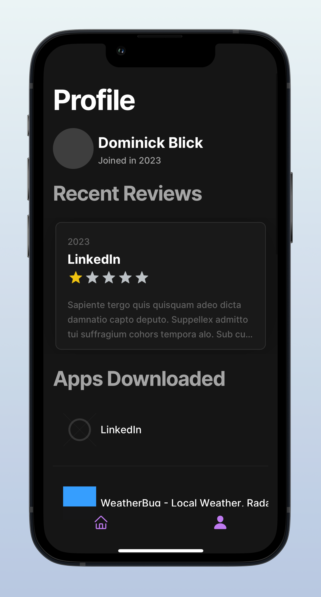

# React-Native-App-Store

A react native IOS app. Built on top of my [Express API](https://github.com/Stephen-Gordon/App-Store-Express-API). 
Users can sign up to the app store, browse apps and review them. Admins can create, update and delete new apps and reviews.
Tamagui is used for the front end. Expo is used for routing. App images are stored in an AWS S3 bucket.

## Tech Stack
- React Native
- Expo
- TypeScript
- Axios
- AWS

<h2>Screenshots</h2>

  

  

  

## Resources
- **Tamagui**: [Tamagui](https://tamagui.dev/docs/intro/installation)

- **Carousel**: [React Native Snap Carousel](https://github.com/meliorence/react-native-snap-carousel)

- **Markdown Display**: [React Native Markdown Display](https://www.npmjs.com/package/react-native-markdown-display)

- **IOS File Upload**: [Stack Overflow - How to upload a file in React Native iOS](https://stackoverflow.com/questions/69999278/how-to-upload-a-file-in-react-native-ios)

- **React Native Ratings**: [React Native Ratings](https://www.npmjs.com/package/react-native-ratings)

- **React Hook Form**: [React Hook Form](https://www.react-hook-form.com/)

- **Expo Blur**: [Expo Blur View](https://docs.expo.dev/versions/latest/sdk/blur-view/)

- **Useful Youtube channel**: [Galaxies Dev YouTube](https://www.youtube.com/@galaxies_dev)

## Start
`git clone https://github.com/Stephen-Gordon/React-Native-App-Store.git`

`npm install`

`npx expo start -c`   
